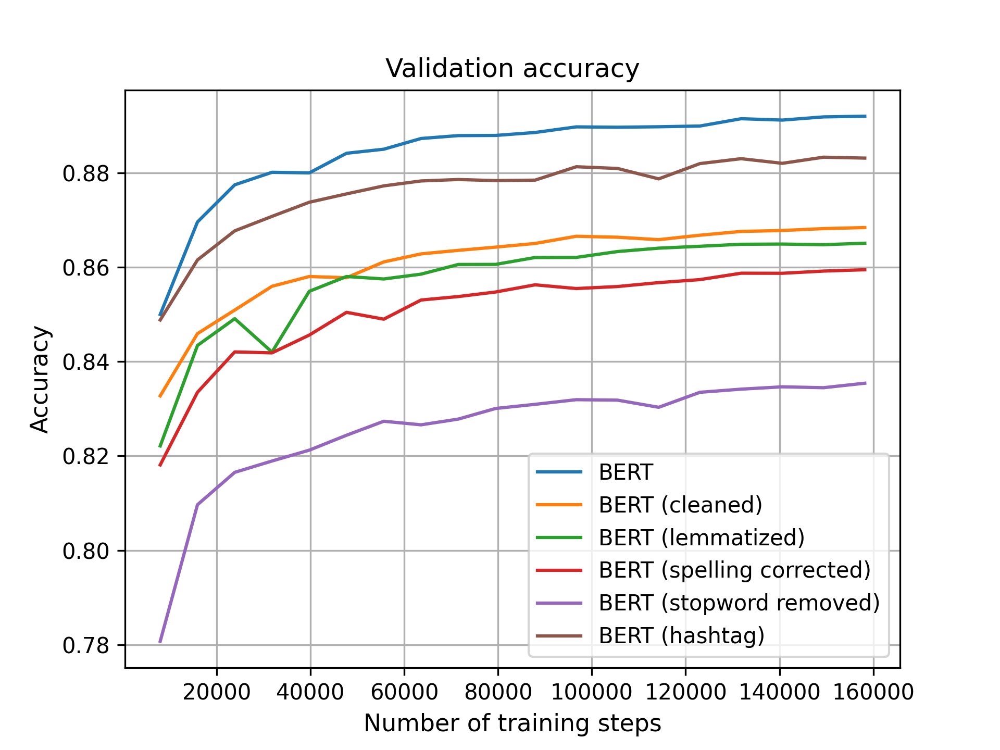
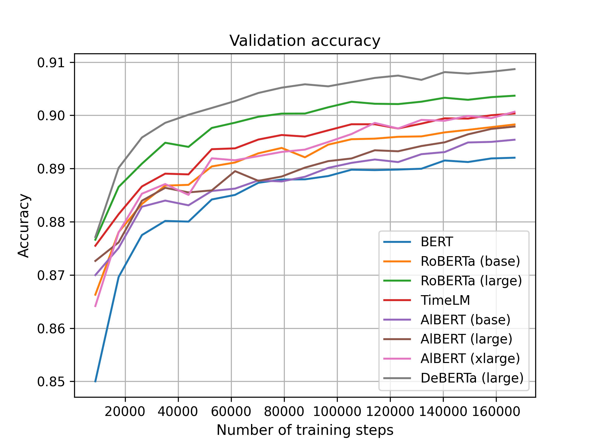

# BERT fine-tuning

## 1. Installation
```bash
$ cd ethz-cil-project/src/bert
$ conda create env -f environment.yaml
$ conda activate twitter
```

To get the data, download this [zip file](https://drive.google.com/file/d/1YNJAKRipuUkPN9yxvgkK9CMYcg6Ou_kQ/view?usp=sharing) and extract everything to the `data/` folder.

For our experiment, we use 4 A5000 GPUs
```bash
+-----------------------------------------------------------------------------+
| NVIDIA-SMI 525.85.12    Driver Version: 525.85.12    CUDA Version: 12.0     |
|-------------------------------+----------------------+----------------------+
| GPU  Name        Persistence-M| Bus-Id        Disp.A | Volatile Uncorr. ECC |
| Fan  Temp  Perf  Pwr:Usage/Cap|         Memory-Usage | GPU-Util  Compute M. |
|                               |                      |               MIG M. |
|===============================+======================+======================|
|   0  NVIDIA RTX A5000    Off  | 00000000:02:00.0 Off |                  Off |
| 30%   27C    P0    56W / 230W |      0MiB / 24564MiB |      0%      Default |
|                               |                      |                  N/A |
+-------------------------------+----------------------+----------------------+
|   1  NVIDIA RTX A5000    Off  | 00000000:03:00.0 Off |                  Off |
| 30%   26C    P0    56W / 230W |      0MiB / 24564MiB |      0%      Default |
|                               |                      |                  N/A |
+-------------------------------+----------------------+----------------------+
|   2  NVIDIA RTX A5000    Off  | 00000000:82:00.0 Off |                  Off |
| 30%   26C    P0    60W / 230W |      0MiB / 24564MiB |      0%      Default |
|                               |                      |                  N/A |
+-------------------------------+----------------------+----------------------+
|   3  NVIDIA RTX A5000    Off  | 00000000:83:00.0 Off |                  Off |
| 30%   26C    P0    56W / 230W |      0MiB / 24564MiB |      2%      Default |
|                               |                      |                  N/A |
+-------------------------------+----------------------+----------------------+

+-----------------------------------------------------------------------------+
| Processes:                                                                  |
|  GPU   GI   CI        PID   Type   Process name                  GPU Memory |
|        ID   ID                                                   Usage      |
|=============================================================================|
|  No running processes found                                                 |
+-----------------------------------------------------------------------------+
```

## 2. Run single model experiments
To fine-tune one of the eight available BERT variants, for instance BERT with the 2-layer MLP classification head, run the following command:

```bash
$ RUN_ID=run_id DEBUG=False make bert_default
```

Similarly, to fine-tune with the attention-based head, change the suffix to `_attention`:
```bash
$ RUN_ID=run_id DEBUG=False make bert_attention
```

If the training is successful, the output will look something like this:
```bash
LOCAL_RANK: 0 - CUDA_VISIBLE_DEVICES: [0,1,2,3]
Predicting DataLoader 0: 100%|█████████████████████████████████████████████████████████████████████████████| 7064/7064 [01:51<00:00, 63.29it/s]
LOCAL_RANK: 0 - CUDA_VISIBLE_DEVICES: [0,1,2,3]
Predicting DataLoader 0: 100%|███████████████████████████████████████████████████████████████████████████████| 313/313 [00:05<00:00, 52.30it/s]
Probing for an optimal decision boundary on the validation set...
Threshold 0.100: accuracy=0.75311
Threshold 0.150: accuracy=0.77830
Threshold 0.200: accuracy=0.79633
Threshold 0.250: accuracy=0.80945
Threshold 0.300: accuracy=0.81944
Threshold 0.350: accuracy=0.82638
Threshold 0.400: accuracy=0.83152
Threshold 0.450: accuracy=0.83469
Threshold 0.500: accuracy=0.83570
Threshold 0.550: accuracy=0.83465
Threshold 0.600: accuracy=0.83145
Threshold 0.650: accuracy=0.82547
Threshold 0.700: accuracy=0.81624
Threshold 0.750: accuracy=0.80263
Threshold 0.800: accuracy=0.78260
Threshold 0.850: accuracy=0.75356
Threshold 0.900: accuracy=0.70958
Threshold 0.950: accuracy=0.63541
Test prediction statistics
Number of negative predictions: tensor(4852)
Number of positive predictions: tensor(5148)
```

Currently, we support eight BERT variants:  
1. bert_
2. roberta-base_
3. roberta-large_
4. albert-base_
5. albert-large_
6. albert-xlarge_
7. timelm_
8. deberta-large_

The results will be saved to the `outputs/target/${RUN_ID}/` folder, where `target` is the make target.

## 3. Ensemble learning
Go to the `stacking.py` and modify the `models` list to include the models that you want to combine. Each item much be of the form `target/${RUN_ID}` as defined above.
Here is the `models` list used in our final submission. 

```python
models = [
    "bert_attention/bert_attention",
    "albert-base_attention/albert-base_attention",
    "albert-large_attention/albert-large_attention",
    "albert-xlarge_attention/albert-xlarge_attention",
    "roberta-base_attention/roberta-base_attention",
    "roberta-large_attention/roberta-large_attention",
    "timelm_attention/timelm_attention",
    "deberta-large_attention/deberta-large_attention",
]
```

Then, run `stacking.py` using this command
```
$ python3 stacking.py
```

## 4. Make the plots for the report

During the experimentation, we used Weights and Biases to track our experiements on the cloud. The dashboard is publicly available at [https://wandb.ai/kvu207/ethz-cil-project?workspace=user-kvu207](https://wandb.ai/kvu207/ethz-cil-project?workspace=user-kvu207).

To create the plots showed in the report, we download the experiment data from W&B and them as CSV files in the `results` folder. Then, the following command will produce the plots
```bash
make plotting
```


